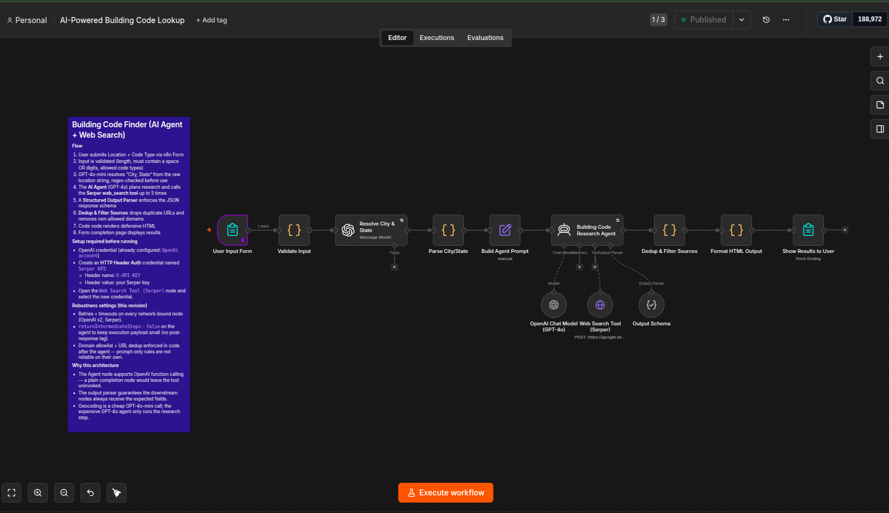

# AI-Powered Building Code Lookup



## Overview
An n8n workflow that takes a US location and a code type, then returns the currently adopted building code, the adopting authority, the state administrative-code reference, any local amendments, and 3–6 official sources.

The workflow uses an OpenAI function-calling agent (GPT-4o) with the Serper Google Search API as a tool. A separate GPT-4o-mini call resolves ambiguous location strings ("Renton WA", a ZIP code, a full street address) into a canonical "City, State" jurisdiction before the agent runs.

---

## How It Works
1. **User Input Form** — n8n form trigger collects `Location` and `Code Type`.
2. **Validate Input** — code node enforces length (3–200 chars) and allowed code-type values.
3. **Resolve City & State** — GPT-4o-mini (temperature 0) resolves the raw location into `City, Full State Name`, or returns `UNKNOWN`.
4. **Parse City/State** — falls back to the raw location if resolution returns `UNKNOWN`.
5. **Build Agent Prompt** — composes the research brief for the agent.
6. **Building Code Research Agent** — GPT-4o agent that calls the `web_search` tool (Serper) up to 5 times following a deliberate search strategy (city ordinance → state administrative code → local amendments).
7. **Structured Output Parser** — enforces the JSON schema for downstream rendering.
8. **Format HTML Output** — code node escapes user content and renders a safe HTML summary.
9. **Show Results to User** — n8n form completion page displays the formatted summary.

---

## Form Inputs
| Field | Type | Notes |
|-------|------|-------|
| `Location` | text (required) | City + State, ZIP, or full address. Example: `Renton WA`, `98168`, `4414 S 144th St`. |
| `Code Type` | dropdown (required) | One of: Building Code, Residential Code, Fire Code, Mechanical Code, Plumbing Code, Electrical Code. |

---

## Output Schema
The agent returns JSON conforming to:
```json
{
  "executive_summary": "2–3 sentence overview of the current code status.",
  "base_code": "e.g., 2021 Uniform Plumbing Code",
  "adopting_authority": "e.g., Washington State Building Code Council",
  "state_code_reference": "e.g., Chapter 51-56 WAC",
  "local_amendments": "Summary of city-specific amendments, or 'None found'.",
  "results": [
    {
      "title": "...",
      "link": "https://...",
      "snippet": "...",
      "source_type": "city | state | publisher | other"
    }
  ]
}
```
The `results` array contains 3–6 official sources, prioritized in this order: official municipal / `.gov` / `.us` domains → recognized publishers (`codepublishing.com`, `municode.com`, `ecode360.com`, `iccsafe.org`) → state agency PDFs.

---

## Setup

### 1. Credentials
Two n8n credentials are required.

**OpenAI** — already wired up in the workflow under the name `OpenAi account`. Open the `Resolve City & State` and `OpenAI Chat Model (GPT-4o)` nodes and confirm the credential is selected.

**Serper API** — create a new credential in n8n:
- Type: **HTTP Header Auth**
- Name: `Serper API`
- Header name: `X-API-KEY`
- Header value: your Serper API key (get one at [serper.dev](https://serper.dev))

Then open the `Web Search Tool (Serper)` node and select the `Serper API` credential. The exported workflow has `REPLACE_WITH_SERPER_CREDENTIAL_ID` as a placeholder until you do this.

### 2. Import the Workflow
1. Open your n8n instance.
2. **Workflows → Import from File** → upload `AI-Powered Building Code Lookup.json`.
3. After import, open the two OpenAI-backed nodes and the Serper node and verify credentials are attached.
4. Activate the workflow.

### 3. Run
Open the form URL exposed by the **User Input Form** node (path: `building-code-finder`), fill in a location and code type, and submit. The result page renders inline.

---

## Models & Cost Profile
| Step | Model | Why |
|------|-------|-----|
| City/state resolution | `gpt-4o-mini` (temp 0) | Cheap, deterministic geocoding. |
| Research agent | `gpt-4o` (temp 0.1) | Function-calling support and reliable grounding. |
| Web search tool | Serper (`google.serper.dev/search`) | Up to 5 calls per run; agent decides when to stop. |

---

## Architectural Notes
- The agent node (`@n8n/n8n-nodes-langchain.agent`) is required for tool calling — attaching tools to a plain LLM completion node leaves them uninvoked.
- The Structured Output Parser is wired as the agent's `ai_outputParser`, so the HTML node always receives the expected shape.
- The HTML formatter escapes all user/AI strings and validates URLs against `^https?://` before rendering, to keep the form completion page safe from injection.
- The agent system prompt forbids fabricated URLs — every link in the output must come from a `web_search` tool result in that run.

---

## Files
- `AI-Powered Building Code Lookup.json` — the n8n workflow export.
- `User_Instructions.md` — end-user guide for running the form.
- `Outbrief_Session.md` — session debrief and next-step recommendations.

---

© 2026 Greyfibre Developer Network | Prepared by Bilal Haider
